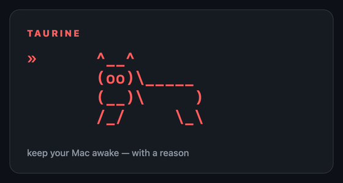

<div align="center">

# Taurine 🐂

**Keep your Mac awake — with a reason.**



</div>

Most "keep awake" apps are a light switch: on, off, and no idea why the room's
still lit. Taurine fixes the parts that annoy you about the others.

Tell it *why* to stay up and it lets go on its own:

```bash
taurine -- make build      # awake for exactly this command, then done
```

Ask *who's* keeping your Mac awake — Taurine or anything else — and it actually
answers:

```bash
taurine why
```

And while it's holding the line, a bull gallops out of your menu bar to say so.

Ask what your Mac is *spending itself on* and it answers in watts, from the
chip's own energy counters, with no password and nothing running until you open
the panel.

No polling, no network, no analytics. **0 idle timers, 0 sockets**, and a
resident figure read live from the kernel rather than asserted here: the menu
badge shows all three, and on macOS 26 it reads about 45 MB, nearly all of it
AppKit pages shared with every other app on the Mac.

> "Taurine" is the energy-drink amino acid (and *Taurus*, the bull). No
> affiliation with, or endorsement by, any beverage company.

---

## Install

### Homebrew (recommended)

```bash
brew install john-athan/tap/taurine
taurine            # launches the menu bar app
```

That's it — the `taurine` CLI is on your `PATH` immediately, and running it
with no arguments launches the menu bar app. Homebrew builds from source on
your machine, so there's **no "unidentified developer" Gatekeeper prompt** and
nothing to notarize.

To also keep it in `/Applications` (for the login-item toggle):

```bash
cp -R "$(brew --prefix taurine)/Taurine.app" /Applications/
```

### Make (no Homebrew)

```bash
git clone https://github.com/john-athan/taurine && cd taurine
make install       # builds, installs to /Applications, links the CLI, launches
```

`make uninstall` reverses it.

### Fully manual

```bash
./build.sh
cp -R Taurine.app /Applications/ && open /Applications/Taurine.app
sudo ln -sf /Applications/Taurine.app/Contents/MacOS/taurine /usr/local/bin/taurine
```

No `sudo`? Link into a dir you own instead:

```bash
mkdir -p ~/.local/bin
ln -sf /Applications/Taurine.app/Contents/MacOS/taurine ~/.local/bin/taurine
echo 'export PATH="$HOME/.local/bin:$PATH"' >> ~/.zshrc && source ~/.zshrc
```

Requires macOS 13+ and the Xcode command line tools (`xcode-select --install`).
No Xcode project, no dependencies, just `swiftc`.

`make test` builds the app into a test binary and runs it. Same toolchain, no
package manager, no network. See
[ADR 1](docs/adr/0001-tests-without-a-package-manager.md).

---

## Use

**Menu bar** — click the ⚡ bull for the menu, or hit the global hotkey
**⌃⌥⌘R** from anywhere to toggle.

The menu gives you:

| Item | What it does |
|---|---|
| **Toggle** | Classic on/off. Bull gallops in, bull dozes off. |
| **Keep awake for…** | 15 min / 30 min / 1 h / 2 h, then auto-off. |
| **Stay awake until an app quits…** | Pick a running app; Taurine releases the instant it exits. |
| **Why is my Mac awake?** | Live list of every process holding a sleep assertion. |
| **What is this Mac doing?** | The activity panel: cores, GPU, watts, battery, memory, disk, network. Costs nothing until you open it. |
| *(the badge)* | `45.2 MB · 0 timers · 0 sockets`, read live from the kernel every time the menu opens. Not a claim, a measurement. |
| **Charge limit** | Stop charging at 60–90% to spare the cell. One admin prompt to install, then free forever. |
| **Things Apple got wrong** | Small fixes the system should have shipped. Currently: scroll direction per device; ⌘X / ⌘V to cut and paste files in Finder; ⌫ to move files to the Trash; ↩ to open them; and ⇧⌘V to paste as plain text in every application. |
| **Also prevent system sleep** | Not just the display — the whole machine (for long jobs). |
| **Keep awake with lid closed (AC only)** | Off by default — a closed lid sleeps normally. On, and only while awake + plugged in, Taurine holds the lid open too (`pmset disablesleep`, needs admin). Reverts on unplug, toggle-off, or quit. |
| **Auto-off under 20% on battery** | The conscience. Won't drain your laptop overnight. |
| **Start awake at launch** / **Start at login** | Set once, forget. |

> **Lid-closed, carefully.** Ordinary sleep assertions (everything else Taurine
> does) don't survive a shut lid — that's *clamshell* sleep, a separate path. The
> only lever is `pmset disablesleep`, which is system-wide and persistent, so
> Taurine engages it only while awake + on AC and always puts it back. A hard
> crash can leave it set; if a closed lid ever won't sleep, run
> `sudo pmset -a disablesleep 0`. And don't stuff an awake, lid-shut Mac in a bag.

---

## What is this Mac doing? 📈

Everything `mactop` shows you in a terminal, in a panel that drops out of the
menu bar: per-cluster and per-core load with the frequency each cluster is
actually running at, GPU utilisation, CPU, GPU and Neural Engine watts, memory
split into app, wired and compressed with swap when swap is in use, and disk and
network rates with a minute of history.

**And the plug, which is the other half of the question on a laptop.** The
battery tile says how full the cell is, which way the energy is moving and how
fast, how long the gauge thinks that leaves, and what the adapter is delivering
against what it is rated for: `adapter 27.9 W of 30 W` next to `CHARGING 21.4 W`
is a Mac charging as fast as that adapter allows. Read from the battery gauge in
the IO registry, never from an undocumented SMC key, and the wall figure is shown
only when the machine's own telemetry corroborates it. A Mac with no battery
simply has no battery tile. See
[ADR 9](docs/adr/0009-the-battery-is-read-from-the-gauge.md).

**No password.** Every other Mac power monitor shells out to `powermetrics`,
which will not run without root. Taurine reads the same energy counters directly
through IOReport, which an ordinary process may do, so the panel never asks for
anything. See [ADR 3](docs/adr/0003-ioreport-for-power-without-root.md).

**No cost while it is shut.** Nothing samples until the panel is on screen.
Opening it creates one repeating timer and opens the probes; closing it cancels
the timer, closes the probes and throws the history away. The panel prints its
own receipt while it is up, in the same voice as the menu badge:
`This panel: 1 timer · 1 sample a second · Taurine 45.2 MB`, with the megabytes
read live from the kernel. See
[ADR 2](docs/adr/0002-the-activity-panel-costs-nothing-while-closed.md).

Anything this Mac cannot answer is left out rather than drawn as a zero, with a
line at the bottom naming what is missing and why.

---

## Things Apple got wrong ⚙️

A shelf for settings the system should have shipped correctly. The rule for
what belongs here: small, local, reversible, and obviously right once you see
it.

**Scroll direction follows the device.** macOS has one scroll direction for the
whole machine, so anyone using a trackpad and a wheel mouse has to pick which of
the two feels wrong. Switch this on and each device gets the direction it
should have had: trackpads and the Magic Mouse scroll naturally, wheel mice
scroll the traditional way. Flip the system setting and the correction moves to
the other class, so the feature works the same for people who prefer the
traditional feel everywhere.

Off by default, because modifying scroll events needs Accessibility permission,
and Taurine would rather ask for nothing until you ask it to. macOS grants that
permission to a specific build of a binary, so a rebuild or an upgrade means
granting it again: remove Taurine from the Accessibility list with the minus
button and add it back. The menu item says so when that has happened, instead of
looking switched on and doing nothing.

One known limit, stated because you would otherwise find it yourself: a mouse
driven by vendor software (Logi Options+ and friends) hands macOS scroll events
already reshaped to look like a trackpad's, so Taurine leaves them alone and the
feature appears to do nothing for that mouse. Invert the wheel in the vendor
software instead, or quit it and let Apple's own driver present the mouse. The
reasoning, the evidence and the better design that is not written yet are all in
[ADR 4](docs/adr/0004-scroll-direction-belongs-to-the-device.md).

**⌘X and ⌘V cut and paste files in Finder.** ⌘X has never done anything in
Finder. The move has always been there, as ⌥⌘V ("Move Item Here"), behind a
keystroke almost nobody finds. Switch this on and the two keys your hands
already know do it:

```
⌘X  →  ⌘C     copy, and remember a cut is pending
⌘V  →  ⌥⌘V    Move Item Here, if that cut is still on the pasteboard
```

**Taurine moves no files.** It rewrites two keystrokes into two Finder already
answers, and Finder does the rest, so the progress sheet, the "an item with that
name already exists" dialog, the password prompt for a folder you don't own and
⌘Z to undo all behave exactly as they always do. Renaming is untouched: in a
text field ⌘X still cuts text. Nothing moves until you paste, so a cut you never
paste is just a copy you never pasted, and ⌘C or Escape calls it off.

Off by default, and it needs the same Accessibility permission as the scroll
fix. The keyboard tap it uses exists **only while Finder is the front
application**: switch to anything else and the tap and its thread are gone, so
there is nothing that could see you typing. The evidence, the measurements and
the cases where it declines to act are in
[ADR 6](docs/adr/0006-cut-and-paste-in-finder.md).

**⌫ moves files to the Trash.** In Finder the Delete key does nothing. Not
something surprising: nothing at all. The command is there, on ⌘⌫, and the key
your hand reaches for is inert. Switch this on and ⌫ becomes ⌘⌫, so Finder puts
the selection in the Trash with its own confirmation, its own password prompt for
files you don't own, and ⌘Z to bring them back. Nothing is deleted and nothing is
in Taurine's hands.

Because this key can throw something away, it is careful in a way the cut fix is
not. It fires only when Finder positively reports a list of files: a rename
field, a search box, a dialog, or **any question Finder fails to answer** all
leave ⌫ exactly as it is today. One surprise worth knowing before you switch it
on: with the sidebar focused, ⌘⌫ removes a favourite rather than a file, and this
cannot tell the two lists apart.

**↩ opens instead of renaming, and ⌘↩ renames.** Finder is the only file manager
where Return renames. Switch this on and ↩ becomes ⌘O; renaming moves to ⌘↩,
which Finder leaves unbound. Inside a rename field ↩ still commits the name. This
one is taste rather than a mistake, which is why it is its own switch.

Both of these share the tap and the permission with the cut fix, and both are
laid out with their measurements in
[ADR 7](docs/adr/0007-finders-other-two-keys.md).

**⇧⌘V pastes as plain text everywhere.** Chrome, Firefox, VS Code and Slack put
"paste without formatting" on ⇧⌘V. Pages, Keynote, Mail, Notes, Safari and
TextEdit put the same command on ⌥⇧⌘V. So the shortcut works or doesn't
depending on which window is in front.

This one uses **no tap and no permission**. macOS can already override a menu
item's shortcut by title, for every application at once, and that is what System
Settings writes when you add an App Shortcut by hand. Taurine writes the same
entry, in English and in German, and merges rather than replacing, so anything
you bound yourself is left alone and switching off leaves the preference exactly
as it was found. Applications pick it up the next time they start. Why a
preference beats a system-wide keyboard tap, and what it does not cover, is in
[ADR 8](docs/adr/0008-one-shortcut-for-pasting-plain-text.md).

---

## Charge limit 🔋

Lithium cells age fastest sitting at 100%. Taurine can stop charging at 80% and
hold there while you stay plugged in.

```bash
taurine batt              # what's it doing right now?
taurine batt 80           # stop charging at 80%
taurine batt off          # back to charging all the way
taurine batt unlock       # escape hatch, see below
```

Enable it once from **Charge limit → Enable charge limiting…** in the menu. That
installs a small root LaunchDaemon (the same binary, run with `--charge-daemon`)
and asks for your password once. After that, changing the limit is just a number
written to a file the daemon is watching, so it never prompts again.

**How it works.** The System Management Controller has a key that decides whether
the wall adapter may charge the cell: `CHTE` on macOS 26+, `CH0B`+`CH0C` before
that. Taurine probes which one your Mac has rather than checking a version
number, and talks to it directly through IOKit. There's no bundled `smc` binary
and nothing gets shelled out.

**It costs you nothing to run.** No timers, no polling, no 30-second wake-ups.
The daemon sleeps in `mach_msg` at 0% CPU and is woken only by the kernel: a
power-source change, a wake from sleep, or you picking a new limit. It writes to
the SMC a couple of times a day, and a 3% deadband below the limit keeps it from
flapping at the boundary.

> **The escape hatch.** The inhibit bit lives in the SMC, not in the daemon, so a
> hard kill at the wrong moment could leave a Mac that won't charge. `KeepAlive`
> plus a recover-on-start covers this, and any clean exit releases the bit. If it
> ever does get stuck, `taurine batt unlock` clears it unconditionally. Run
> `make uninstall` and the daemon is released before its binary is removed.

---

## CLI 💻

```bash
taurine                    # launch the menu bar app
taurine -- make build      # awake for exactly this command's lifetime
taurine why                # who is keeping this Mac awake right now?
taurine on | off | toggle  # drive the running menu bar app
taurine batt               # show the charge limit
taurine batt 80            # stop charging at 80%
taurine batt off           # charge to 100% again
taurine batt unlock        # force-permit charging (if the daemon ever dies)
taurine help
```

`taurine -- <command>` is `caffeinate <command>` with a pulse: it prints a bull,
holds display **and** system assertions for the child's life, and lets go the
moment it exits, which is what you want in front of a long build or upload.

---

## How it is built

Decisions worth writing down live in [docs/adr](docs/adr/README.md): why there
is no package manager, why the activity panel costs nothing while it is closed,
why power comes from IOReport rather than `powermetrics`, why the battery is
read from its gauge and the wall figure has to corroborate itself, which kernel
counters are read wide enough not to wrap, why scroll direction belongs to the
device,
how ⌘X, ⌫ and ↩ are rewritten in Finder without Taurine touching a single file,
and why the plain-text paste fix deliberately uses a system preference instead
of a keyboard tap.

### Nothing here is borrowed, and that is checked rather than assumed

[THIRD_PARTY.md](THIRD_PARTY.md) records everything in the repository that came
from somewhere else, and `scripts/provenance-check.py` asks GitHub code search
whether the distinctive identifiers added since the last tag also co-occur in
somebody else's repository. A hit under a copyleft license fails the build;
anything else is reported for a human to read, because two projects solving the
same small problem converge more often than either copies. The
[Provenance workflow](.github/workflows/provenance.yml) runs it on every `v*`
tag, once a month, and on demand. The useful moment is local, before tagging,
while the answer can still change the release:

```bash
./scripts/provenance-check.py            # changes since the last tag
./scripts/provenance-check.py --all      # every tracked source file
```

---

## License

MIT, see [LICENSE](LICENSE). Do what you like; keep the notice.

Taurine is not affiliated with, authorised by, or endorsed by Apple Inc. Apple,
macOS and Finder are trademarks of Apple Inc., used here only to say which
system this software runs on and which parts of it these fixes address.
"Things Apple got wrong" is the author's opinion about product design. No
affiliation with any energy drink is claimed either.
